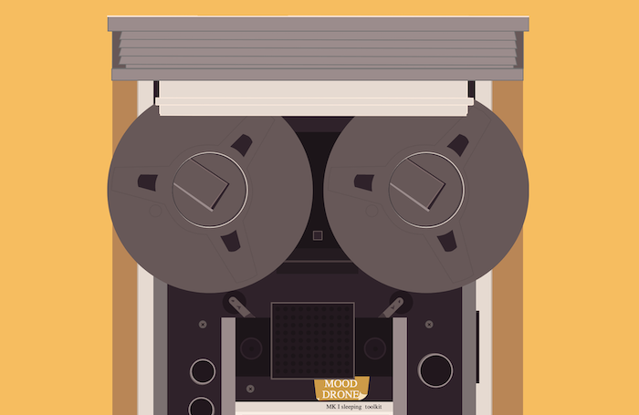

<div align="center">

 <h1> mood drone 📻 </h1>
 web radio app and sleep enhancer. <br /> <br />
  


<br />
Linux • macOS • Windows • Web
<br />
</div>


# About
Mood Drone 📻 is an open source web app mimicking a radio widget. It is inspired on Docubyte's phenomenal [Guide to Computing.](https://www.docubyte.com/works/guide-to-computing/)

I'd hoped for it to support user defined alarms, but I will make a separate drone for sleeping. Right now it's mostly intended to play moody songs that would lull the user to a productive work day or night.

This app was made possible by the help of:
* [Itoroabasi Unang](https://github.com/unangity), who solved the loop issue

## Usage

Just ```npm run dev``` for development

## Dependencies 

Parcel, React, ReactDOM, GSAP

## Misc 

```npx babel-upgrade``` could maybe be necessary for the latest Babel version to work.
